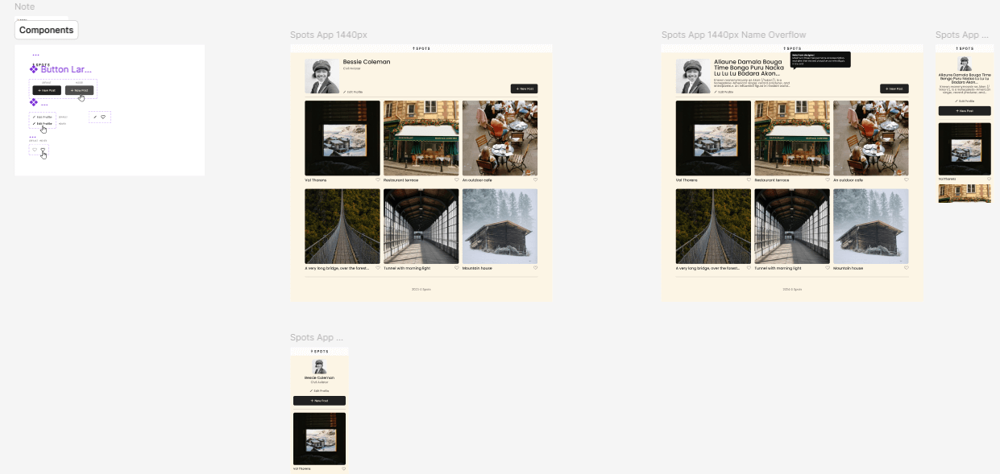

# Project 3: Spots

### Overview  

This project is made to display adaptable elements that allow for viewing on popular screen sizes.

* Figma - project design
* Grid - organization of cards that allow for adaptability
* Media - for alternate styles on mobile devices
* Custom Fonts - for styling
 
**Project on github pages!**
*[https://echoslimes.github.io/se_project_spots/](https://echoslimes.github.io/se_project_spots/)

**Images**  

Design followed on Figma
